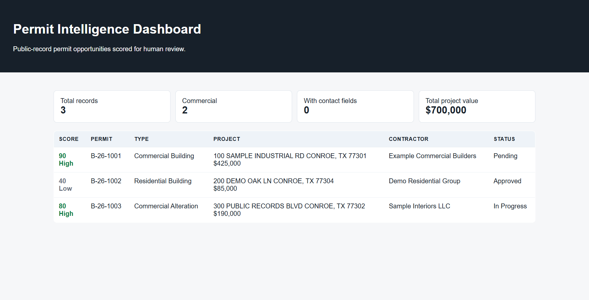

# Permit Intelligence Dashboard

[](https://github.com/GalToast/permit-intelligence-dashboard/actions/workflows/tests.yml)

Public-record data pipeline for turning building permits into reviewable business opportunities.

This project is a sanitized portfolio version of a local permit-intelligence workflow. It combines public permit search, parcel enrichment, scoring, CSV/JSON exports, and a static dashboard concept for operator review. The point is not spam automation. The point is practical data work: collect public records, enrich them, score them, and give a human a clean review surface.



## What It Demonstrates

- Browser automation against public permit portals
- Public ArcGIS REST API enrichment
- Lead/opportunity scoring from noisy records
- Static dashboard generation
- Rate limiting and polite scraping defaults
- Separation between raw public data and review-ready outputs
- Business automation thinking without hiding the human review step

## Architecture

```text
public permit portal
  -> permit scraper
  -> parcel/property enrichment
  -> scoring + filtering
  -> CSV / JSON exports
  -> static dashboard for review
```

## Repository Layout

| Path | Purpose |
| --- | --- |
| `src/permit_scraper.py` | Playwright scraper for public OpenGov-style permit search |
| `src/parcel_client.py` | Public ArcGIS REST API parcel lookup client |
| `src/pipeline.py` | End-to-end scrape, enrich, score, and export pipeline |
| `src/dashboard.py` | Static HTML dashboard generator |
| `examples/sample_permits.json` | Synthetic sample data for local dashboard testing |
| `docs/portfolio-case-study.md` | Recruiter-facing explanation of the project |
| `docs/assets/permit-dashboard.png` | Screenshot of the generated static dashboard using sample data |

## Proof Artifacts

| Artifact | What it shows |
| --- | --- |
| `src/dashboard.py` | Static review-surface generator; run the quick start below to create `dashboard.html` locally |
| `examples/sample_permits.json` | Synthetic sample input for safe demo generation |
| `docs/portfolio-case-study.md` | Portfolio framing and implementation narrative |
| `tests/` | Deterministic parsing, scoring, and export checks |

## Quick Start

### Dashboard-only demo (no browser needed)

This path uses only the synthetic sample data. It does **not** need Playwright at
all — `requirements.txt` contains just the HTTP/parsing libraries, so neither
the Playwright package nor its browser download (`playwright install chromium`)
is installed. (Playwright lives in the optional `requirements-scrape.txt`, used
only for the live pipeline below.)

```bash
python -m venv .venv
# Windows:
.venv\Scripts\activate
# macOS / Linux:
source .venv/bin/activate
pip install -r requirements.txt
```

Generate a dashboard from the synthetic sample:

```bash
python src/dashboard.py --input examples/sample_permits.json --output dashboard.html
```

Run focused tests:

```bash
python -m unittest discover -s tests
```

### Optional: live public-record pipeline

The live pipeline drives a real browser against the public OpenGov portal and
queries the public ArcGIS enrichment layer. It needs the optional scraping
dependencies plus the Chromium download (~150MB), and takes longer:

```bash
pip install -r requirements-scrape.txt
playwright install chromium
python src/pipeline.py --max-permits 10 --min-cost 50000 --headless
```

Write JSON, CSV, and a static dashboard in one pass:

```bash
python src/pipeline.py --max-permits 10 --min-cost 50000 --headless --dashboard dashboard.html
```

Targeting a different city portal is supported:

```bash
python src/pipeline.py --portal https://othertown.portal.opengov.com --city OTHERTOWN --max-permits 10
```

## Parcel Enrichment Data Source

Parcel enrichment uses the public City of Conroe ArcGIS REST service
(`src/parcel_client.py`, `PublicParcelClient`). Verified 2026-09-30:

- The polygon parcel layer (`Conroe_Parcels`, MapServer layer 2) publishes
  43,348 features but serves every attribute field (situs, ownerName, values,
  year built, ...) blank or zero. Address matching against it silently returns
  nothing, so it is **not** used by default.
- The default source is the populated address-points layer
  (`Conroe_Address_Point_Public_View`, MapServer layer 1, 47,905 features),
  matched on its `ADDRESS` field. Returned enrichment includes owner, year
  built, improvement area, subdivision, and legal description.
- To point the client at a different layer (e.g. if layer 2 is repopulated),
  pass `parcel_layer=<id>` to `PublicParcelClient`. The field mapping accepts
  both layers' field-name schemas.

## Configuration

The default implementation targets the City of Conroe public OpenGov and ArcGIS endpoints because those were the original research surface. The code is intentionally written so another OpenGov-style city portal can be substituted with a different base URL.

No API keys are required for the included public endpoints.

Live scraping is portal-layout dependent. The deterministic parts of the repo, including money parsing, address extraction, scoring, export, and dashboard rendering, are covered by focused tests.

## Data Provenance

The public repo uses synthetic sample data for the bundled dashboard demo. Live runs are intended for public permit and parcel records from open government portals, with rate limits and portal terms respected. Raw exports and opportunity lists should be treated as private review artifacts unless there is a clear legal and ethical reason to publish them.

## Ethics

Use this kind of workflow carefully:

- Respect robots.txt, portal terms, rate limits, and public-data restrictions.
- Do not scrape behind logins or access controls.
- Do not publish raw personal contact exports.
- Treat generated opportunity lists as review queues, not automated spam targets.
- Keep outreach compliant with applicable law and platform rules.

## Hiring Signal

For AI-adjacent and automation roles, this repo shows a practical pattern: use AI and automation around public data, but keep the output bounded, inspectable, and reviewable by a human operator.
